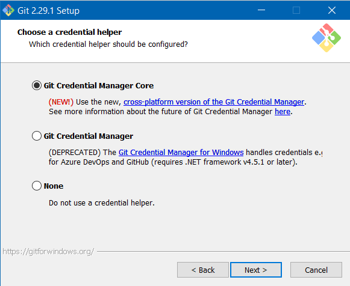

# Vim-Config
A repo containing my vimrc and all my config files for vim 8.3. (For Windows 10)


## Usage

Install git from https://gitforwindows.org/. Make sure to install the 64 bit version.

Run the ```.exe``` file that you just downloaded.

Then, ensure that your setup screens look like these:

*(Only for Git 2.29.1)*

-----


-----


-----


-----


-----


-----


-----


-----


-----



-----


-----


-----


-----
